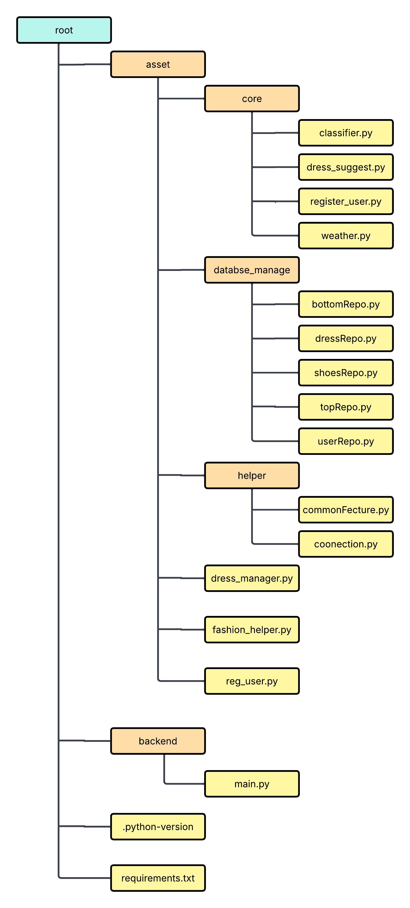

## How to Run

Follow these steps to set up and run the project locally:

1. **Clone the repository:**
   ```bash
   git clone https://github.com/tauhidhasanslu-bot/cvindel_final
    ````

2. **Navigate to the project directory:**

   ```bash
   cd root/cvindel_final
   ```

3. **Create a `.env` file** in the project root and add the following environment variables:

   ```bash
   GOOGLE_API_KEY=
   MONGO_URI=
   ```

4. **Create a virtual environment (Python 3.12 recommended):**

   ```bash
   python 3.12 -m venv venv
   ```

5. **Activate the virtual environment:**

   * On **Windows:**

     ```bash
     venv\Scripts\activate
     ```
   * On **macOS/Linux:**

     ```bash
     source venv/bin/activate
     ```

6. **Install project dependencies:**

   ```bash
   pip install -r requirements.txt
   ```

7. **Run the application using Uvicorn:**

   ```bash
   uvicorn backend.main:app --reload
   ```


# Project Folder Structure

## Figure

*Figure: Overall project folder structure and component relationship.*

---

---
## Project Description

Based on the file and folder names from your diagram, here is a one-line description for each node, inferring its likely purpose in what looks like a Python-based fashion suggestion application.

---

### Root Directory

* **root/** — The main project directory containing all source code and configuration.

---

### Asset Package

#### `asset/`

A main source code package containing the application's logic.

##### Core Logic

* **asset/core/** — Holds the primary business logic modules for the application.

  * **classifier.py** — Likely uses a model to classify images (e.g., clothing type, color).
  * **dress_suggest.py** — Contains the core logic for generating outfit suggestions.
  * **register_user.py** — Handles the business logic for new user sign-ups.
  * **weather.py** — Connects to a weather API to get data for outfit suggestions.

##### Database Management

* **asset/databse_manage/** *(likely meant to be `database_manage/`)* — Manages all database interactions (Data Access Layer).

  * **bottomRepo.py** — Manages database operations (CRUD) for “bottom” clothing items (pants, skirts).
  * **dressRepo.py** — Manages database operations for general dress or clothing items.
  * **shoesRepo.py** — Manages database operations for shoe items.
  * **topRepo.py** — Manages database operations for “top” clothing items (shirts, t-shirts).
  * **userRepo.py** — Manages database operations for user data (profiles, credentials).

##### Helper Utilities

* **asset/helper/** — Contains utility functions reused across the project.

  * **commonFecture.py** *(likely `commonFeature.py`)* — Common reusable functions (e.g., validation, formatting).
  * **coonectio.py** *(likely `connection.py`)* — Manages database connection setup and teardown.

##### Other Modules

* **dress_manager.py** — Coordinates tasks related to managing dresses or outfits.
* **fashion_helper.py** — Provides utility functions related to fashion rules or logic.
* **reg_user.py** — Handles user registration (note: duplicate functionality with `core/register_user.py`).

---

### Backend

#### `backend/`

Likely holds the web server or API code (e.g., Flask, FastAPI).

* **main.py** — The main entry point to run the backend server.

---

### Configuration Files

* **.python-version** — Specifies the exact Python version for this project (used by tools like `pyenv`).
* **requirements.txt** — Lists all Python dependencies needed to run the project.

---

> ## ⚠️**Note:**  
> If you want to use **Gemini Pro** or another Gemini model, go to  
> `asset/helper/commonFecture.py` and replace the following line with your preferred model:
> ```python
> model_name = "gemini-2.5-flash"
> ```


